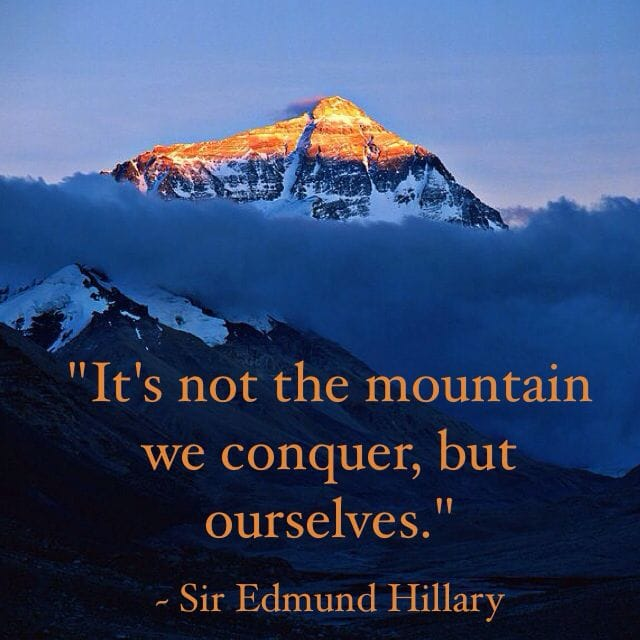
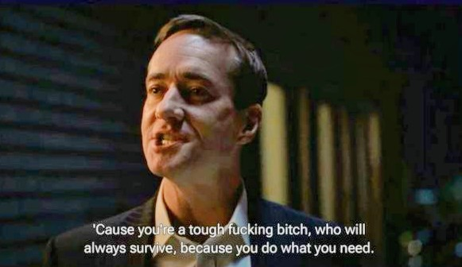
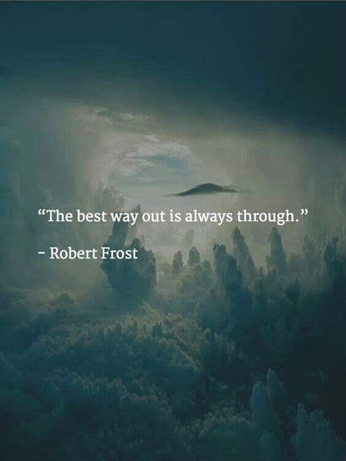
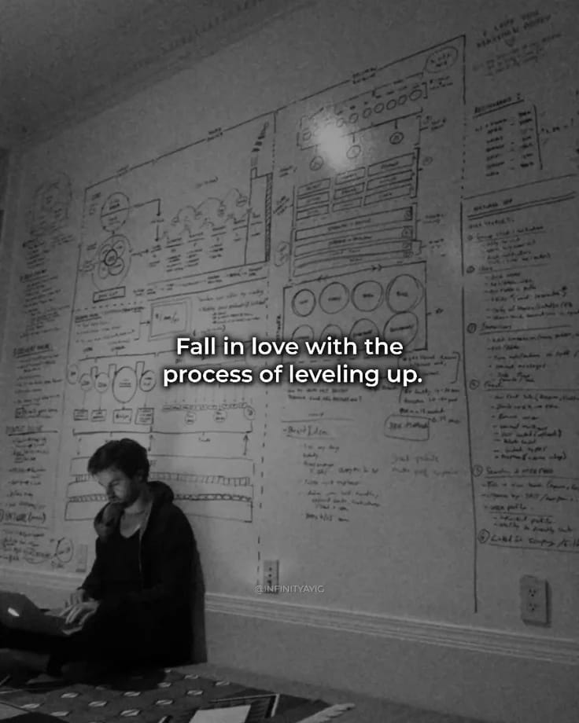
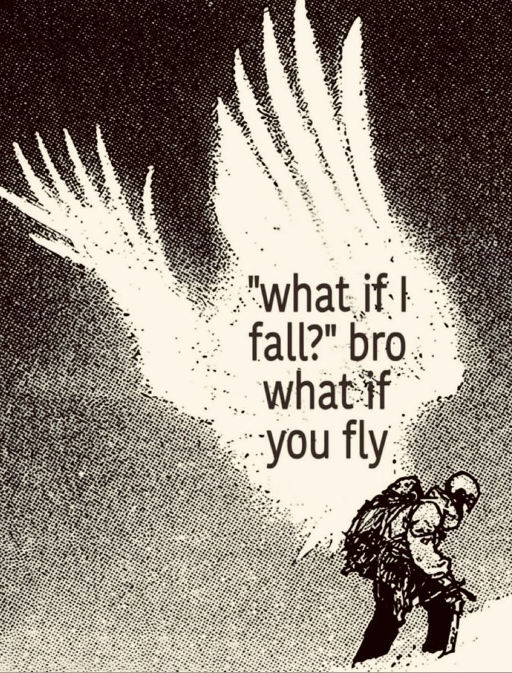

# PATH_TO_MASTER

A space to keep a grip on the fundamentals in one place. Learning out loud ;)

- This covers: Fundamental C++, Advanced C++, low-latency concepts and tools,
Data Structures, and Algorithms.

- Notes will include theory, implementations, or small projects when needed, with some good questions.

- No fixed schedule, I'll move at my own pace, with minimal use of AI.

- Code here is for learning, so expect rough edges. If you find something
interesting or spot an issue, lmk.

- As I move, I will add my blogs, technical analysis, and whitepapers.

- [RULES](RULES.md) -> the rules I hold myself to.

- [TODO](TODO.md) -> what's on my plate right now.

### For the hard days 🪖

It's your Snowman Trek: 

- have fun in the process, 
- stay clear on the why and what you're learning, 
- dig deep instead of rushing through.

